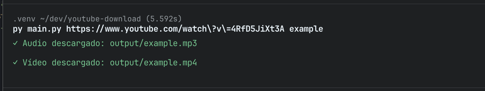

# YouTube Downloader

- Download YouTube videos in MP4 and MP3 format
- Best available quality for video (MP4) and audio (MP3 at 192kbps)
- Error handling with styled messages
- Argument validation
- Simple command-line interface




## Requirements

- Python 3.8 or newer
- `pip` (Python package manager)
- `ffmpeg` installed and available in PATH

## Installation

1. Clone the repository or download the project files.

```bash
git clone git@github.com:hectorOliSan/youtube-download.git
```

2. Create a virtual environment:

```bash
python -m venv .venv
```

3. Activate the virtual environment:

```bash
source .venv/bin/activate     # Linux/macOS
.venv\Scripts\activate        # Windows
```

4. Install the dependencies:

```bash
pip install -r requirements.txt
```

5. Install `ffmpeg` (required for MP3 conversion):

```bash
brew install ffmpeg            # macOS
sudo apt install ffmpeg        # Ubuntu/Debian
```

## Project Structure

```
youtube-download/
├── output/              # Directory where downloads are saved
├── main.py              # Main file with the downloader logic
├── decorators.py        # Decorators for error handling and styling
├── requirements.txt     # Project dependencies
├── .gitignore
└── README.md
```

### Dependencies

- `yt-dlp`: Library to download videos from YouTube and other platforms
- `rich`: Terminal styling and colors

## Usage

```bash
python main.py <url>
```

- `<url>`: YouTube video URL. It can be a full URL or a short URL (e.g. `youtu.be/...`).

Two files will be created for each download:
  - `<video_title>.mp4` - Video file
  - `<video_title>.mp3` - Audio file

```bash
python main.py https://www.youtube.com/watch?v=dQw4w9WgXcQ
```

## Output

Generated files are saved in the `output/` directory, which is created automatically if it does not exist.

The video title is used as the filename, with invalid characters replaced automatically.
